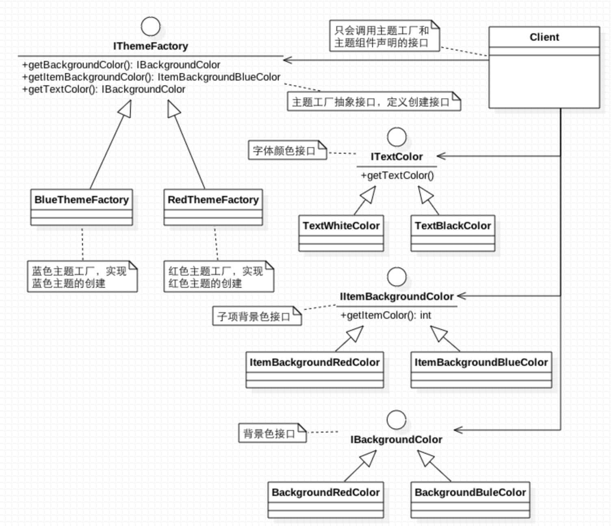

##抽象工厂模式（Abstract Factory）

####它能带来什么

* 它是一种对象创建模式，所以它是用来创建对象的。
* 它可以提供一个或一组创建接口，使用这些接口可以创建一系列相关的产品，而无需指定产品具体的类。  
* 它可以把产品的创建过程隔离出来。

####为什么要使用它

当你的软件需要支持多种主题风格，有窗口、滚动条、字体、背景等等。需要随时并且轻易切换主题。而主题组件的调用者（如UI开发者）并不关心每种主题的实现细节，只需要获得指定主题的组件。

####结构图

这是一个简单的抽象工厂的UML结构图，实现了红色和蓝色两种主题，使用者只需要通过IThemeFactory声明的接口创建主题，再通过ITextColor、IIItemBackgroundColor、IBackgroundColor提供的接口配置颜色即可。

####参与的角色
* IThemeFactory ：主题抽象工厂接口，定义一组用于创建主题组件的接口。
* RedThemeFactory、BlueThemeFactory：工厂实现类，用于创建指定主题各个组件。
* IItemBackgroundColor、ITextColor、IBackgroundColor：各个主题组件的接口。
* TextBlackColor、ItemBackgroundRedColor、BackgroundRedColor、BackgroundBlueColor、ItemBackgroundBlueColor、TextWhiteColor：各个主题组件的实现类。
* Client:只使用IThemeFactory和IItemBackgroundColor、ITextColor、IBackgroundColor声明的接口。

####优缺点

* 它分离的具体的产品类，调用者只通过接口操纵实例。
* 􏳰􏵘􏳹􏰦􏵙􏳣􏵚􏵛􏰭􏵜􏵇􏳰􏵘􏳹􏰦􏵙􏳣􏵚􏵛􏰭􏵜􏵇􏳰􏵘􏳹􏰦􏵙􏳣􏵚􏵛􏰭􏵜􏵇它使产品系列可以灵活的切换。
* 它有利于产品的一致性。
* 它难以支撑新品种的产品。

####相关的模式
* Singleton（单例模式），一般抽象工厂模式需要一个创建工厂类用于管理，而这个类通常是单利模式。
* Factory Method（方法工厂），抽象工厂接口与产品系列接口一般是方法工厂模式。

####Android代码示例

下面代码实现了一个简单的给ListView换色。

	/**
	* 主题抽象工厂
	*/
	public interface IThemeFactory {
	   	IBackgroundColor getBackgroundColor();
	   	IItemBackgroundColor getItemBackgroundColor();
	   	ITextColor getTextColor();
	}
	/**
	* 字体颜色
	*/
	public interface ITextColor {
	   	int getTextColor();
	}
	/**
	 * 背景色
	 */
	public interface IBackgroundColor {
	    int getColor();
	}
	/**
	 * 项背景色
	 */
	public interface IItemBackgroundColor {
	    int getItemColor();
	}
	/**
	 * 蓝色主题
	 */
	public class BlueThemeFactory implements IThemeFactory {
	    @Override
	    public IBackgroundColor getBackgroundColor() {
	        return new BackgroundBlueColor();
	    }

	    @Override
	    public IItemBackgroundColor getItemBackgroundColor() {
	        return new ItemBackgroundBlueColor();
	    }

	    @Override
	    public ITextColor getTextColor() {
	        return new TextWhiteColor();
	    }
	}

	/**
	 * 蓝色
	 */
	public class BackgroundBlueColor implements IBackgroundColor {
	    @Override
	    public int getColor() {
	        return Color.BLUE;
	    }
	}
	/**
	 * 蓝色项背景
	 */
	public class ItemBackgroundBlueColor implements IItemBackgroundColor {
	    @Override
	    public int getItemColor() {
	        return Color.BLUE;
	    }
	}
	/**
	 * 白色字体
	 */
	public class TextWhiteColor implements ITextColor {
	    @Override
	    public int getTextColor() {
	        return Color.WHITE;
	    }
	}
	/**
	 * 红色主题
	 */
	public class RedThemeFactory implements IThemeFactory {
	    @Override
	    public IBackgroundColor getBackgroundColor() {
	        return new BackgroundRedColor();
	    }

	    @Override
	    public IItemBackgroundColor getItemBackgroundColor() {
	        return new ItemBackgroundRedColor();
	    }

	    @Override
	    public ITextColor getTextColor() {
	        return new TextBlackColor();
	    }
	}

	/**
	 * 红色背景
	 */
	public class BackgroundRedColor implements IBackgroundColor {
	    @Override
	    public int getColor() {
	        return Color.RED;
	    }
	}
	/**
	 * 红色背景
	 */
	public class ItemBackgroundRedColor implements IItemBackgroundColor {
	    @Override
	    public int getItemColor() {
	        return Color.RED;
	    }
	}
	/**
	 * 黑色字体
	 */
	public class TextBlackColor implements ITextColor {
	    @Override
	    public int getTextColor() {
	        return Color.BLACK;
	    }
	}

####源码

这个例子的源码在GitHub [DesignPattern仓库](https://github.com/ruoshuisanqian/DesignPattern)的abstractfactory模块中。

