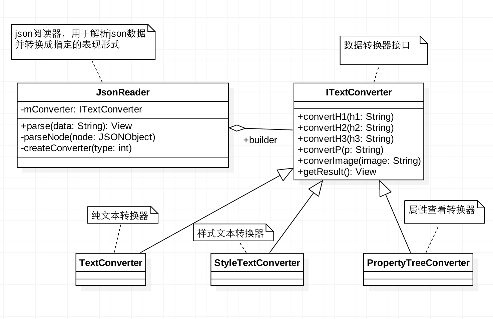
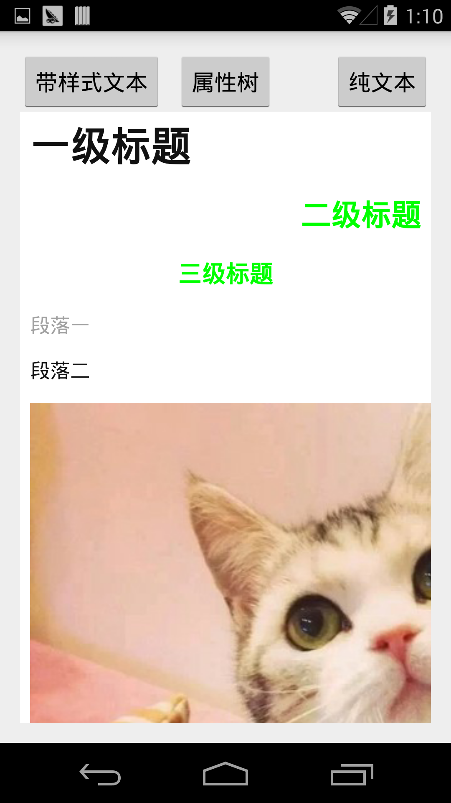
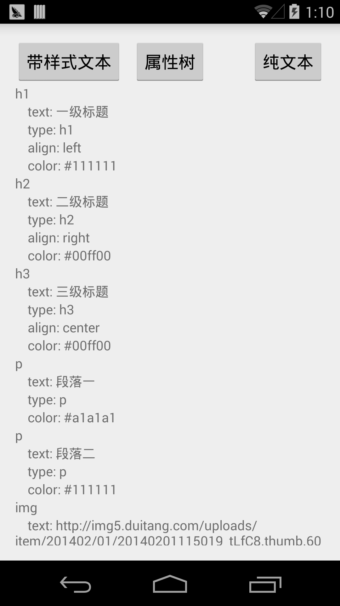
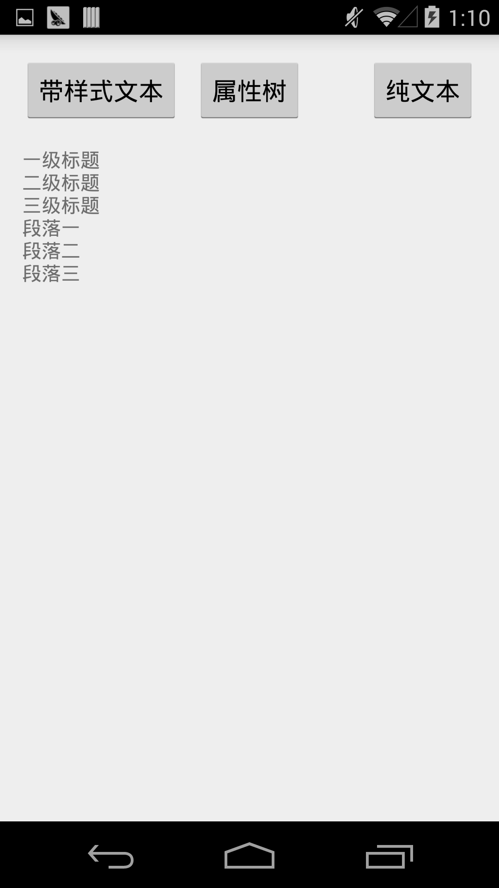

##生成器模式（Builder）

####它能带来什么

* 它是一种对象创建模式，所以它可以用来创建对象。
* 可以把一个复杂对象的构建与它的表现形式分离，使相同的构建过程可以轻松的构建出不同的表现形式。
* 当一个复杂对象必须有不同的表现形式时，它可以带来充分的灵活性。

####什么时候使用它

一个软件阅读器，它有多种阅读模式，支持纯文本的模式阅读，也支持图文并茂的丰富模式，或者是可交互的可以更改、批注的阅读模式，也或许是其他无穷多种的阅读方式。但其实它的文档只有一种格式。

####优缺点

* 生成器使你可以随意改变被构造对象的内部表现形式，builder对象只对外提供了一个抽象的生成（转化）接口，而被构建对象到底是如何生成或者是生成什么样的对象，都是由builder的子类来决定。如果想要一种的新的表现形式只需要继承builder。
* 使构造过程成为独立的模块，更加利于单独维护。
* 使构造过程得到更加精确的控制，生成器只提供每一个组件的构造接口，而整个构建过程是由向导类完成的，这样可以是你十分精细的控制构建过程。

####相关的模式

* 抽象工厂模式（Abstract Factory）与生成器模式（Builder）都是对象创建模式，不过它们的侧重点不同。生成器侧重于复杂对象的构建过程，抽象工厂模式则侧重于多个系列的产品对象。
*  组合模式（Composite）对象通常是由生成器模式构建的。

####一个简单的例子

下面是一个将json数据转换成不同展现的简单例子。

#####结构图

这是一个生成器的UML结构图。JsonReader是向导器，负责对象的整体构建过程。ITextConverter是生成器接口，声明了每一个组件的构建接口。TextConverter、StyleTextConverter、PropertyTreeConverter是各个生成器的实现类，负责每一个组件的实现细节。

####参与的角色

* ITextConverter：生成器接口类，定义了一组转换接口。
* JsonReader：向导器，负责控制对象的整个构建过程。
* TextConverter、StyleTextConverter、PropertyTreeConverter：生成器各个实现类，负责实现具体的转换细节。

#####部分Android代码示例

	public class JsonReader {

	    private ITextConverter mConverter;

	    public JsonReader(Context context , int type){
	        createConverter(context, type);
	    }

	    public View parse(String data){
	        JSONObject body;
	        try {
	            body = new JSONObject(data);
	            if(body.has("data")){
	                JSONArray array = body.getJSONArray("data");
	                for (int i = 0; i < array.length(); i++) {
	                    parseNode(array.getJSONObject(i));
	                }
	            }
	            return mConverter.getResult();
	        } catch (JSONException e) {
	            e.printStackTrace();
	            return null;
	        }

	    }

	    private void parseNode(JSONObject node) throws JSONException {
	        if(node.has(Constant.TYPE)){
	            String type = node.getString(Constant.TYPE);
	            switch (type){
	                case Constant.H1:
	                    mConverter.convertH1(node.toString());
	                    break;
	                case Constant.H2:
	                    mConverter.convertH2(node.toString());
	                    break;
	                case Constant.H3:
	                    mConverter.convertH3(node.toString());
	                    break;
	                case Constant.P:
	                    mConverter.convertP(node.toString());
	                    break;
	                case Constant.IMAGE:
	                    mConverter.convertImage(node.toString());
	                    break;
	                default:
	                    mConverter.convertP(node.toString());
	                    break;
	            }
	        }
	    }

	    private void createConverter(Context context , int type){
	        switch (type){
	            case Constant.TEXT_CONVERTER:
	                mConverter = new TextConverter(context);
	                break;
	            case Constant.STYLE_TEXT_CONVERTER:
	                mConverter = new StyleTextConverter(context);
	                break;
	            case Constant.PROPERTY_TREE_CONVERTER:
	                mConverter = new PropertyTreeConverter(context);
	                break;
	            default:
	                mConverter = new TextConverter(context);
	                break;
	        }
	    }
	}	
	/**
	 * 文本转换接口
	 */
	public abstract class ITextConverter {

	    protected Context mContext;

	    public ITextConverter(Context context) {
	        mContext = context;
	    }

	    /**
	     * 转换一级标题
	     * @param h1 一级标题
	     */
	    public abstract void convertH1(String h1) throws JSONException;

	    /**
	     * 转换二级标题
	     * @param h2 二级标题
	     */
	    public abstract void convertH2(String h2) throws JSONException;

	    /**
	     * 转换三级标题
	     * @param h3 三级标题
	     */
	    public abstract void convertH3(String h3) throws JSONException;

	    /**
	     * 转换正文段落
	     */
	    public abstract void convertP(String p) throws JSONException;

	    /**
	     * 转换图片
	     * @param image 图片链接
	     */

	    public void convertImage(String image) throws JSONException {}

	    /**
	     * 获取转换结果
	     * @return 结果view
	     */
	    public abstract View getResult();

	    /**
	     * 清除结果
	     */
	    public abstract void clear();
	}
	/**
	 * 纯文本转换
	 */
	public class TextConverter extends ITextConverter{

	    private TextView mTextView;

	    public TextConverter(Context context) {
	        super(context);
	        mTextView = new TextView(mContext);
	    }

	    @Override
	    public void convertH1(String h1) throws JSONException {
	        JSONObject jsonObject = new JSONObject(h1);
	        mTextView.append("\n");
	        mTextView.append(jsonObject.getString(Constant.TEXT));
	    }

	    @Override
	    public void convertH2(String h2) throws JSONException {
	        JSONObject jsonObject = new JSONObject(h2);
	        mTextView.append("\n");
	        mTextView.append(jsonObject.getString(Constant.TEXT));
	    }

	    @Override
	    public void convertH3(String h3) throws JSONException {
	        JSONObject jsonObject = new JSONObject(h3);
	        mTextView.append("\n");
	        mTextView.append(jsonObject.getString(Constant.TEXT));
	    }

	    @Override
	    public void convertP(String p) throws JSONException {
	        JSONObject jsonObject = new JSONObject(p);
	        mTextView.append("\n");
	        mTextView.append(jsonObject.getString(Constant.TEXT));
	    }

	    @Override
	    public View getResult() {
	        return mTextView;
	    }

	    @Override
	    public void clear() {
	        mTextView.setText("");
	    }
	}
	/**
	 * 带样式的文本转换器

	 */
	public class StyleTextConverter extends ITextConverter {

	    private WebView mWebView;
	    private StringBuilder mStringBuilder;

	    public StyleTextConverter(Context context) {
	        super(context);
	        mWebView = new WebView(mContext);
	        mStringBuilder = new StringBuilder();
	    }

	    @Override
	    public void convertH1(String h1) throws JSONException {
	        JSONObject jsonObject = new JSONObject(h1);
	        mStringBuilder.append("<h1 ").append(getStyle(jsonObject)).append(">")
	                .append(jsonObject.getString(Constant.TEXT)).append("</h1>");
	    }

	    @Override
	    public void convertH2(String h2) throws JSONException {
	        JSONObject jsonObject = new JSONObject(h2);
	        mStringBuilder.append("<h2 ").append(getStyle(jsonObject)).append(">")
	                .append(jsonObject.getString(Constant.TEXT)).append("</h2>");
	    }

	    @Override
	    public void convertH3(String h3) throws JSONException {
	        JSONObject jsonObject = new JSONObject(h3);
	        mStringBuilder.append("<h3 ").append(getStyle(jsonObject)).append(">")
	                .append(jsonObject.getString(Constant.TEXT)).append("</h3>");
	    }

	    @Override
	    public void convertP(String p) throws JSONException {
	        JSONObject jsonObject = new JSONObject(p);
	        mStringBuilder.append("
")
	                .append(jsonObject.getString(Constant.TEXT)).append("
");
	    }

	    @Override
	    public void convertImage(String image) throws JSONException {
	        JSONObject jsonObject = new JSONObject(image);
	        mStringBuilder.append("");
	    }

	    private String getStyle(JSONObject jsonObject) throws JSONException {
	        StringBuilder stringBuilder = new StringBuilder("style=\"");
	        if(jsonObject.has(Constant.ALIGN)){
	            String align = jsonObject.getString(Constant.ALIGN);
	            stringBuilder.append("text-align:").append(align).append(";");
	        }
	        if(jsonObject.has(Constant.COLOR)){
	            String color = jsonObject.getString(Constant.COLOR);
	            stringBuilder.append("color:").append(color).append(";");
	        }
	        stringBuilder.append("\"");
	        return stringBuilder.toString();
	    }

	    @Override
	    public View getResult() {
	        mWebView.loadData(mStringBuilder.toString(), "text/html; charset=UTF-8", null);
	        return mWebView;
	    }

	    @Override
	    public void clear() {
	        mStringBuilder = new StringBuilder();
	    }
	}
/**
 * 属性树 转换器
 * Created by wanglx on 15/10/12.
 */
public class PropertyTreeConverter extends ITextConverter {

	    private AndroidTreeView mAndroidTreeView;
	    private TreeNode mRoot;

	    public PropertyTreeConverter(Context context) {
	        super(context);
	        mRoot = TreeNode.root();
	        mAndroidTreeView = new AndroidTreeView(mContext, mRoot);
	    }

	    @Override
	    public void convertH1(String h1) throws JSONException {
	        JSONObject jsonObject = new JSONObject(h1);
	        TreeNode node = new TreeNode(Constant.H1);
	        addNode(node, jsonObject);
	        mRoot.addChild(node);
	    }

	    @Override
	    public void convertH2(String h2) throws JSONException {
	        JSONObject jsonObject = new JSONObject(h2);
	        TreeNode node = new TreeNode(Constant.H2);
	        addNode(node, jsonObject);
	        mRoot.addChild(node);
	    }

	    @Override
	    public void convertH3(String h3) throws JSONException {
	        JSONObject jsonObject = new JSONObject(h3);
	        TreeNode node = new TreeNode(Constant.H3);
	        addNode(node, jsonObject);
	        mRoot.addChild(node);
	    }

	    @Override
	    public void convertP(String p) throws JSONException {
	        JSONObject jsonObject = new JSONObject(p);
	        TreeNode node = new TreeNode(Constant.P);
	        addNode(node, jsonObject);
	        mRoot.addChild(node);
	    }

	    @Override
	    public void convertImage(String image) throws JSONException {
	        JSONObject jsonObject = new JSONObject(image);
	        TreeNode node = new TreeNode(Constant.IMAGE);
	        addNode(node, jsonObject);
	        mRoot.addChild(node);
	    }

	    private void addNode(TreeNode node, JSONObject jsonObject) throws JSONException {
	        node.setExpanded(true);
	        if(jsonObject.has(Constant.TEXT)){
	            node.addChild(new TreeNode("    " + Constant.TEXT + ": " 
	            + jsonObject.get(Constant.TEXT)));
	        }
	        if(jsonObject.has(Constant.TYPE)){
	            node.addChild(new TreeNode("    " + Constant.TYPE + ": " 
	            + jsonObject.get(Constant.TYPE)));
	        }
	        if(jsonObject.has(Constant.ALIGN)){
	            node.addChild(new TreeNode("    " + Constant.ALIGN + ": " 
	            + jsonObject.get(Constant.ALIGN)));
	        }
	        if(jsonObject.has(Constant.COLOR)){
	            node.addChild(new TreeNode("    " + Constant.COLOR + ": " 
	            + jsonObject.get(Constant.COLOR)));
	        }
	    }

	    @Override
	    public View getResult() {
	        return mAndroidTreeView.getView();
	    }

	    @Override
	    public void clear() {
	    }
	}

#####效果展示

#####源码
这个例子的完整源码在GitHub [DesignPattern仓库](https://github.com/ruoshuisanqian/DesignPattern)的builder模块中。