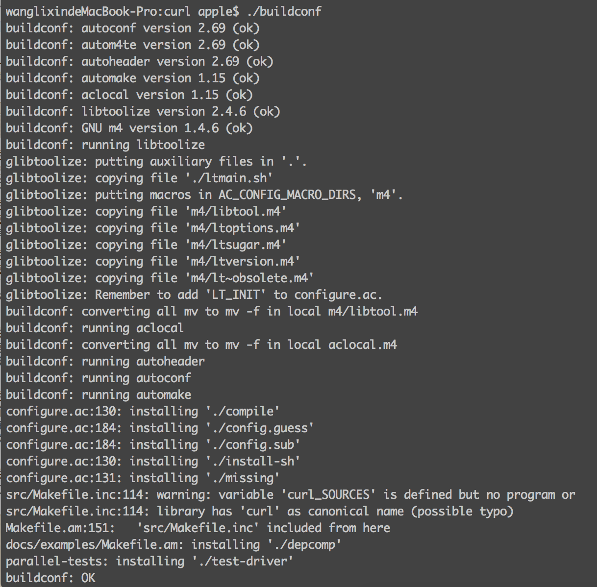
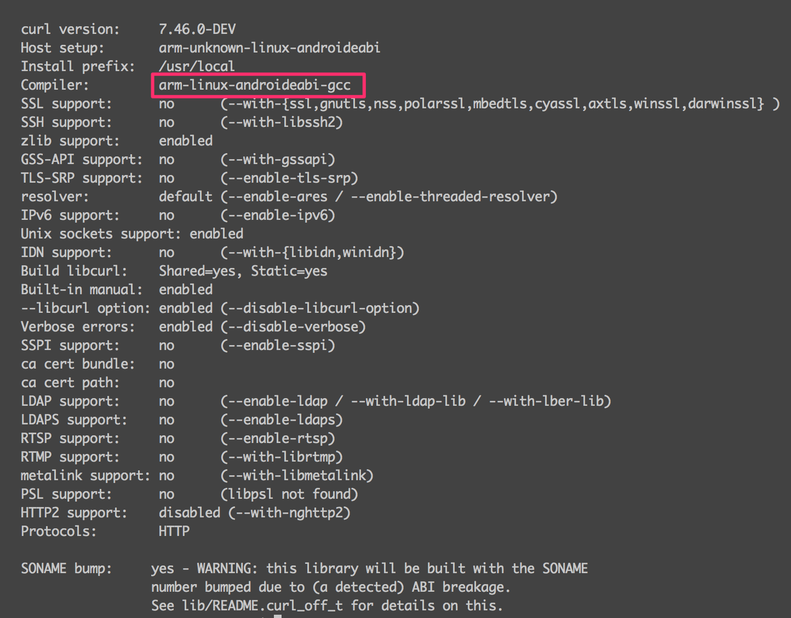
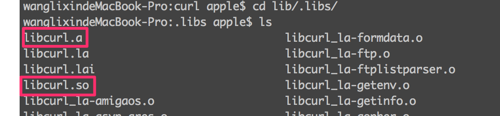
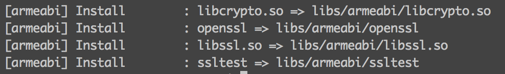

###curl移植到android(MAC)

####一、 ndk toolchain（工具链）

1. 下载DNK[http://developer.android.com/tools/sdk/ndk/index.html](http://developer.android.com/tools/sdk/ndk/index.html) 
2. 设置编译环境变量，在.bash_profile中添加

    	NDK=/Library/android-ndk-r10e
    	export NDK
    	export LDFLAGS="-L/Library/NDK/android-ndk-r10e/platforms/android-21/arch-arm/usr/lib"
		export CPPFLAGS="-I/Library/NDK/android-ndk-r10e/platforms/android-21/arch-arm/usr/include"
LDFLAGS：指定编译器需要的lib库  CPPFLAGS：编译时需要的头文件、宏、配置。
3. 从NDK中导出编译工具，在NDK跟目录下执行：

		./build/tools/make-standalone-toolchain.sh
会生成一个arm-linux-androideabi-4.8的压缩文件，解压到指定的路径下。添加到环境变量：
 
		export PATH=${PATH}:/Library/arm-linux-androideabi-4.8/bin
 到此NDK的编译环境就搭建完成。
 
####二、编译curl源码（不支持ssl）

1. 下载curl源码 https://github.com/bagder/curl
2. 进入到curl源码路径下执行：

		buildconf
这个命令会构建配置环境，这个时候可能会执行错误，是因为需要几个工具：autoconf  automake libtool 这几个工具都可以用 brew 来安装。结果类似于下图

3. 配置编译选项 ，buildconf 后会生成configure文件，这时执行：

		 ./configure --host=arm-linux-androideabi \
		--without-ssl \
		--disable-ftp \
		--disable-gopher \
		--disable-file \
		--disable-imap \
		--disable-ldap \
		--disable-ldaps \
		--disable-pop3 \
		--disable-proxy \
		--disable-rtsp \
		--disable-smtp \
		--disable-telnet \
		--disable-tftp \
		--without-gnutls \
		--without-libidn \
		--without-librtmp \
		--disable-dict
     来配置编译选项，注意这个-without-ssl 选项，说明这个curl编译出来是不支持ssl的（后面会说如何支持ssl）。结果类似于下图：
     
在这里要注意：Compiler:  arm-linux-androideabi-gcc 

4. make 生成libcurl 静态库和动态库配置完成后执行：

		 make
	make 完成后libcur库文件就生成了 libcurl.a 和 libcurl.so 都在lib/.lib/路径下，头文件在include/curl下。
	如何支持ssl）。结果类似于下图：
     
     
       到此一个不支持ssl的curl库就编译结束了。

####三、编译curl源码（支持ssl）
1. 下载openssl-android项目：[https://github.com/guardianproject/openssl-android](https://github.com/guardianproject/openssl-android)

2. 进入openssl-android目录执行：
         
		 ndk-build
会生成libssl.so 和libcrypto.so两个库。
 
再把两个文件放入到android-ndk-r10c\platforms\android-21\arch-arm\usr\lib目录下；这里的android-21对应上面指定的LDFLAGS；
          然后把openssl-android/include/openssl目录拷贝到android-ndk-r10c/platforms/android-21/arch-arm/usr/include目录；

3. 在curl目录执行

		./configure --host=arm-linux-androideabi \
		--with-ssl \
		--disable-ftp \
		--disable-gopher \
		--disable-file \
		--disable-imap \
		--disable-ldap \
		--disable-ldaps \
		--disable-pop3 \
		--disable-proxy \
		--disable-rtsp \
		--disable-smtp \
		--disable-telnet \
		--disable-tftp \
		--without-gnutls \
		--without-libidn \
		--without-librtmp \
		--disable-dict
4. 执行make

####四、在android中使用curl
1. 将curl项目include文件夹拷入jin文件夹中，将libcurl.a 拷入jin/curllib文件夹内
2. 在android.mk中添加：

		include $(CLEAR_VARS)
		LOCAL_MODULE := curl
		LOCAL_SRC_FILES := ./curllib/libcurl.a
		include $(PREBUILT_STATIC_LIBRARY)
		include $(CLEAR_VARS)

		LOCAL_CFLAGS := -D_GNU_SOURCE
		LOCAL_CPPFLAGS := -frtti
		LOCAL_MODULE:= jni_curl
		LOCAL_SHARED_LIBRARIES := libcurl
		LOCAL_SRC_FILES := jni_main.cpp
		 LOCAL_LDLIBS := -llog
     3.  例子
          * java代码：
          
				public class JniTest {
					static{
			       		System.loadLibrary("jni_curl");
			       	}
			       	native public int curlInit();
			       }

		* c++代码：
          
				static long Post_Response(void *data, int size, int nmemb, std::string &content)
				{
				    long sizes = size * nmemb;
				    std::string temp((char*)data,sizes);
				    content += temp;

				    return sizes;
				}
				JNIEXPORT jint JNICALL Java_curltest_test_JniTest_curlInit(JNIEnv *env, jobject obj)
				{
				    CURL *curl;
				    CURLcode res;
				    std::string content;
				    curl_global_init(CURL_GLOBAL_ALL);
				    curl = curl_easy_init();
				    if (curl) {
				 		curl_easy_setopt(curl, CURLOPT_URL, "http://www.baidu.com");
				     	curl_easy_setopt(curl, CURLOPT_WRITEFUNCTION, Post_Response);
				    	curl_easy_setopt(curl, CURLOPT_WRITEDATA, &content);
				     	res = curl_easy_perform(curl);
				     	if (0!=res) {
				      		LOGD("curl error: %d\n", res);
				     	}
				     	LOGD("curl error: %d\n", res);
				     	LOGD("curl content = %s \n", content.c_str());
				     	curl_easy_cleanup(curl);
				    }
				    curl_global_cleanup();
				    return 1;
				}

